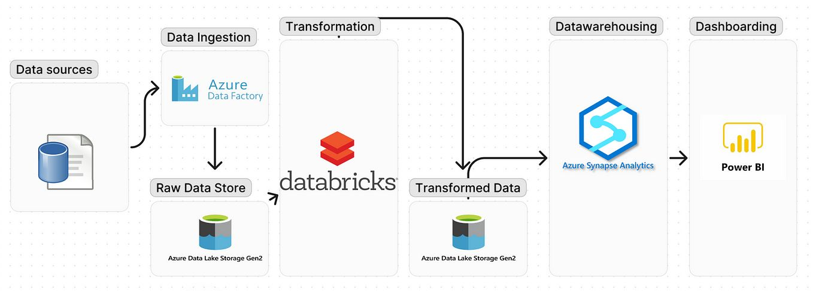

# Azure End-to-End Data Pipeline Design

## Overview
This project demonstrates the design and implementation of an end-to-end data pipeline using Azure services. The pipeline ingests, stores, processes, and visualizes data from an on-premise SQL Server to provide actionable insights through Power BI dashboards.

 ## Data Download
   - **Objective**: Download and restore the AdventureWorksLT2022 sample database to a local on-premises SQL Server.
   - **Steps**:
     1. Download the database backup from [AdventureWorksLT2022.bak](https://github.com/Microsoft/sql-server-samples/releases/download/adventureworks/AdventureWorksLT2022.bak).
     2. Restore the `.bak` file to your local SQL Server instance.

## 1. Data Ingestion

### Tool: Azure Data Factory (ADF)
   - **Tool**: Azure Data Lake Storage (ADLS)
   - **Objective**: Store the raw data in a centralized, scalable data lake for long-term storage.
   - **Steps**:
     1. Create a Data Lake Storage Gen2 account.
     2. Organize the data in the data lake under containers named `bronze`, `silver`, and `gold`.
     3. Store the raw CSV files extracted from SQL Server in the `bronze` container.

## 2. Data Storage (Raw Data)

### Tool: Azure Data Lake Storage (ADLS)
   - **Tool**: Azure Data Lake Storage (ADLS)
   - **Objective**: Store the raw data in a centralized, scalable data lake for long-term storage.
   - **Steps**:
     1. Create a Data Lake Storage Gen2 account.
     2. Organize the data in the data lake under containers named `bronze`, `silver`, and `gold`.
     3. Store the raw CSV files extracted from SQL Server in the `bronze` container.
  
## 3. Data Processing

### Tool: Azure Databricks
   - **Tool**: Azure Databricks
   - **Objective**: Clean, transform, and prepare the data for analysis.
   - **Layers**:
     - **Bronze Layer**: Mount raw parquet files.
     - **Silver Layer**: 
       - First transformation: Convert all date columns to `datetime` format.
       - Store the transformed data.
     - **Gold Layer**:
       - Second transformation: Remove the `rowguid` column, rename all columns to lowercase and snake case.
       - Store the final processed data.
   - **Steps**:
     1. Create Databricks notebooks for each layer.
     2. Perform the transformations as described.

## 4. Data Storage (Processed Data)

### Tool: Azure Synapse Analytics
   - **Tool**: Azure Synapse Analytics
   - **Objective**: Store and manage the processed data for efficient querying and analysis.
   - **Steps**:
     1. Load the final processed data from the `gold` layer into Azure Synapse Analytics.
     2. Create Synapse views for the cleaned and aggregated data.

## 5. Data Visualization

### Tool: Power BI
   - **Tool**: Power BI
   - **Objective**: Create interactive dashboards and reports for data analysis.
   - **Steps**:
     1. Connect Power BI to Azure Synapse Analytics.
     2. Build dashboards to visualize daily, weekly, and monthly sales trends.
     3. Automate the data refresh process in Power BI after ADF triggers the Databricks jobs and loads data into Synapse.

---

